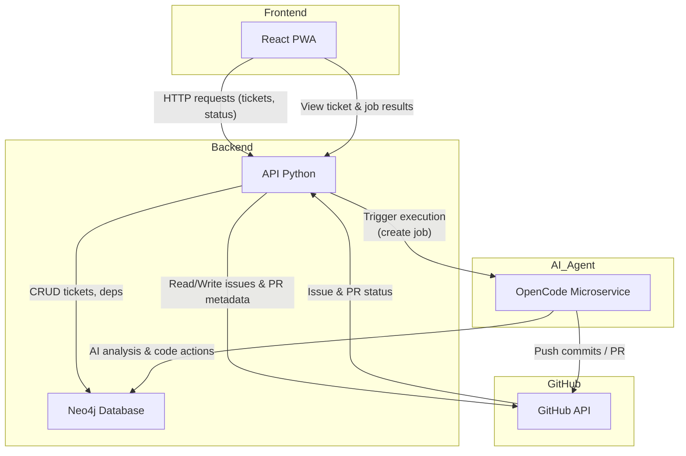
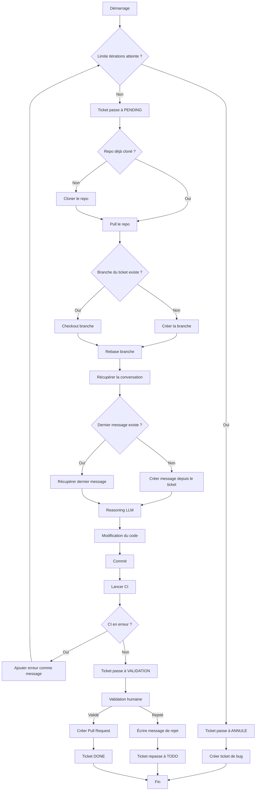

# Description du projet

Auto-Code est une plateforme de gestion de tickets avec développement automatique assisté par IA. Elle permet de créer, organiser et développer automatiquement des tickets de développement en utilisant OpenCode AI dans un environnement Docker isolé.

# Pipeline

## Résolution d'un ticket

- **Ticket = Conversation = Branche Git**
- Les tickets sont créés et modifiés via la PWA, stockés dans Neo4j.
- Un ticket exécutable est sélectionné automatiquement (priorité + dépendances OK).
- Une branche Git et une session OpenCode sont créées.

### Boucle d’exécution

1. Message → analyse (reasoning)
2. Modification du code
3. Commit → CI/CD

- Si la CI échoue, l’erreur est ajoutée comme **message dans la conversation**.
- Le cycle recommence.

#### Limite

- Maximum **20 itérations**.
- Au-delà, l’agent s’arrête et **crée un nouveau ticket de bug** expliquant le blocage.

#### Fin

- CI OK → ticket `DONE`, branche prête à merger.

# Architecture



# Diagramme de flux



# Lancer la base neo4j

# Setup l'env python

# Paramètres pour créer une app GitHub et connexion en auth 2

# Lancer le serveur

# Lancer le front

# Doc open code

https://opencode.ai/docs/server/

# Screenshots de l'app

# Update mermaid

```bash
docker run --rm -u $(id -u):$(id -g) -v $(pwd):/data minlag/mermaid-cli -i flow.mmd -o flow.png
```
