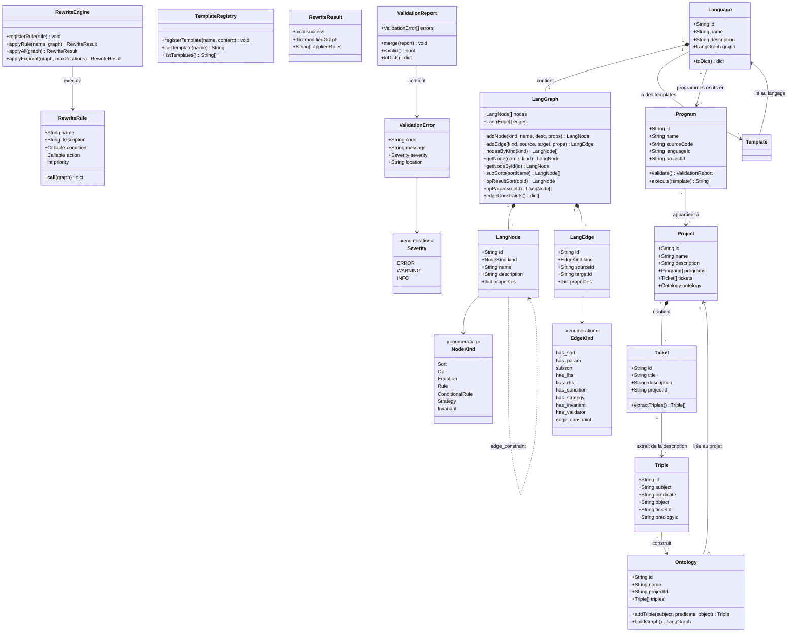

```mermaid
classDiagram
    %% ── Rewriting-Logic Core ─────────────────────────

    class Language {
        +String id
        +String name
        +String description
        +LangGraph graph
        +toDict() dict
    }

    class LangGraph {
        +LangNode[] nodes
        +LangEdge[] edges
        +addNode(kind, name, desc, props) LangNode
        +addEdge(kind, source, target, props) LangEdge
        +nodesByKind(kind) LangNode[]
        +getNode(name, kind) LangNode
        +getNodeById(id) LangNode
        +subSorts(sortName) LangNode[]
        +opResultSort(opId) LangNode
        +opParams(opId) LangNode[]
        +edgeConstraints() dict[]
    }

    class LangNode {
        +String id
        +NodeKind kind
        +String name
        +String description
        +dict properties
    }

    class LangEdge {
        +String id
        +EdgeKind kind
        +String sourceId
        +String targetId
        +dict properties
    }

    class NodeKind {
        <<enumeration>>
        Sort
        Op
        Equation
        Rule
        ConditionalRule
        Strategy
        Invariant
    }

    class EdgeKind {
        <<enumeration>>
        has_sort
        has_param
        subsort
        has_lhs
        has_rhs
        has_condition
        has_strategy
        has_invariant
        has_validator
        edge_constraint
    }

    %% ── Templates liés aux langages ───────────────

    class TemplateRegistry {
        +registerTemplate(name, content) void
        +getTemplate(name) String
        +listTemplates() String[]
    }

    %% ── Rewrite Engine ─────────────────────────────

    class RewriteRule {
        +String name
        +String description
        +Callable condition
        +Callable action
        +int priority
        +__call__(graph) dict
    }

    class RewriteResult {
        +bool success
        +dict modifiedGraph
        +String[] appliedRules
    }

    class RewriteEngine {
        +registerRule(rule) void
        +applyRule(name, graph) RewriteResult
        +applyAll(graph) RewriteResult
        +applyFixpoint(graph, maxIterations) RewriteResult
    }

    %% ── Validation ─────────────────────────────────

    class Severity {
        <<enumeration>>
        ERROR
        WARNING
        INFO
    }

    class ValidationError {
        +String code
        +String message
        +Severity severity
        +String location
    }

    class ValidationReport {
        +ValidationError[] errors
        +merge(report) void
        +isValid() bool
        +toDict() dict
    }

    %% ── Programmes ─────────────────────────────────

    class Program {
        +String id
        +String name
        +String sourceCode
        +String languageId
        +String projectId
        +validate() ValidationReport
        +execute(template) String
    }

    %% ── Projets ────────────────────────────────────

    class Project {
        +String id
        +String name
        +String description
        +Program[] programs
        +Ticket[] tickets
        +Ontology ontology
    }

    %% ── Tickets ────────────────────────────────────

    class Ticket {
        +String id
        +String title
        +String description
        +String projectId
        +extractTriples() Triple[]
    }

    %% ── Triplets ───────────────────────────────────

    class Triple {
        +String id
        +String subject
        +String predicate
        +String object
        +String ticketId
        +String ontologyId
    }

    %% ── Ontologie ──────────────────────────────────

    class Ontology {
        +String id
        +String name
        +String projectId
        +Triple[] triples
        +addTriple(subject, predicate, object) Triple
        +buildGraph() LangGraph
    }

    %% ── Relations ──────────────────────────────────

    Language "1" *-- "1" LangGraph : contient
    LangGraph "1" *-- "*" LangNode
    LangGraph "1" *-- "*" LangEdge
    LangNode --> NodeKind
    LangEdge --> EdgeKind

    Language "1" --> "*" Template : a des templates
    Language "1" --> "*" Program : programmes écrits en

    Program "*" --> "1" Project : appartient à
    Project "1" *-- "*" Ticket : contient
    Ticket "1" --> "*" Triple : extrait de la description
    Triple "*" --> "1" Ontology : construit
    Ontology "1" --> "1" Project : liée au projet

    RewriteEngine --> RewriteRule : exécute
    ValidationReport --> ValidationError : contient
    ValidationError --> Severity

    Template --> Language : lié au langage

    %% ── Relations sémantiques entre nœuds ──────────

    LangNode ..> LangNode : subsort
    LangNode ..> LangNode : has_sort
    LangNode ..> LangNode : has_param
    LangNode ..> LangNode : has_lhs
    LangNode ..> LangNode : has_rhs
    LangNode ..> LangNode : has_condition
    LangNode ..> LangNode : edge_constraint
```
