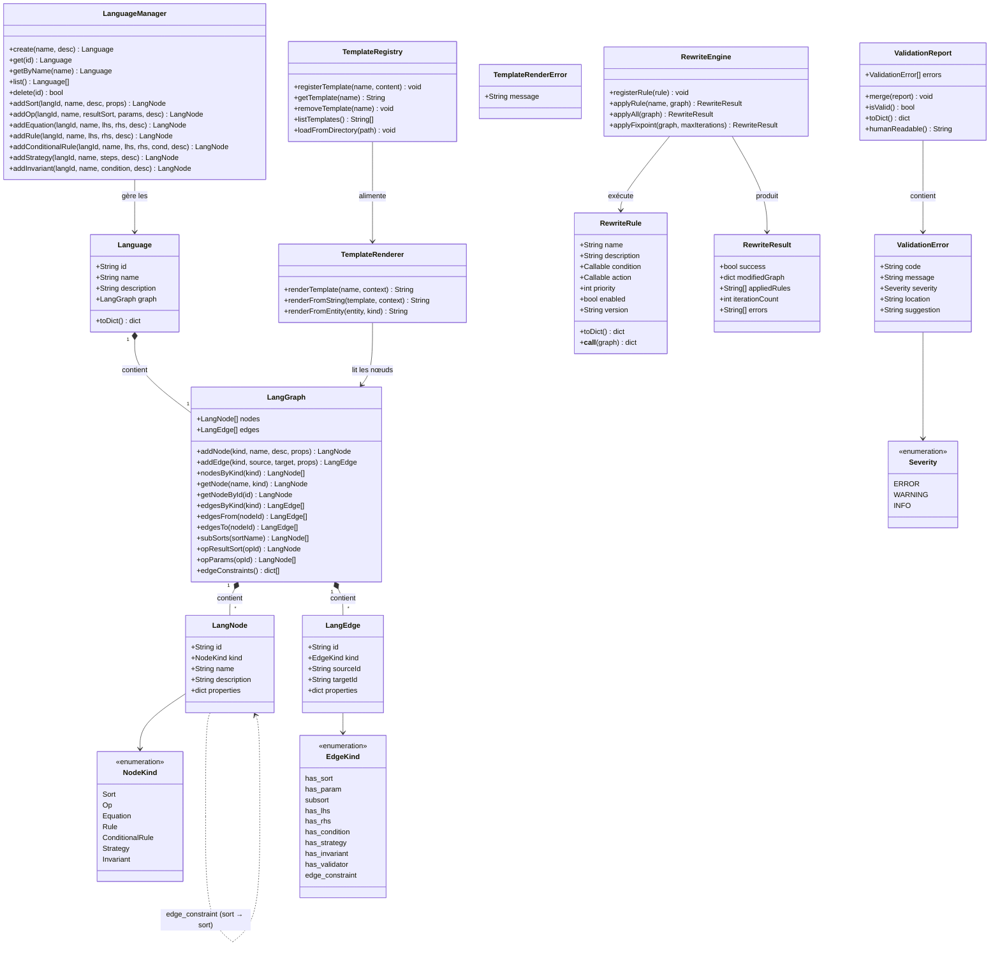

```mermaid
classDiagram
    %% ── Core Rewriting-Logic ──────────────────────────

    class Language {
        +String id
        +String name
        +String description
        +LangGraph graph
        +toDict() dict
    }

    class LangGraph {
        +LangNode[] nodes
        +LangEdge[] edges
        +addNode(kind, name, desc, props) LangNode
        +addEdge(kind, source, target, props) LangEdge
        +nodesByKind(kind) LangNode[]
        +getNode(name, kind) LangNode
        +getNodeById(id) LangNode
        +edgesByKind(kind) LangEdge[]
        +edgesFrom(nodeId) LangEdge[]
        +edgesTo(nodeId) LangEdge[]
        +subSorts(sortName) LangNode[]
        +opResultSort(opId) LangNode
        +opParams(opId) LangNode[]
        +edgeConstraints() dict[]
    }

    class LangNode {
        +String id
        +NodeKind kind
        +String name
        +String description
        +dict properties
    }

    class LangEdge {
        +String id
        +EdgeKind kind
        +String sourceId
        +String targetId
        +dict properties
    }

    class NodeKind {
        <<enumeration>>
        Sort
        Op
        Equation
        Rule
        ConditionalRule
        Strategy
        Invariant
    }

    class EdgeKind {
        <<enumeration>>
        has_sort
        has_param
        subsort
        has_lhs
        has_rhs
        has_condition
        has_strategy
        has_invariant
        has_validator
        edge_constraint
    }

    %% ── Language Manager ───────────────────────────

    class LanguageManager {
        +create(name, desc) Language
        +get(id) Language
        +getByName(name) Language
        +list() Language[]
        +delete(id) bool
        +addSort(langId, name, desc, props) LangNode
        +addOp(langId, name, resultSort, params, desc) LangNode
        +addEquation(langId, name, lhs, rhs, desc) LangNode
        +addRule(langId, name, lhs, rhs, desc) LangNode
        +addConditionalRule(langId, name, lhs, rhs, cond, desc) LangNode
        +addStrategy(langId, name, steps, desc) LangNode
        +addInvariant(langId, name, condition, desc) LangNode
    }

    %% ── Templates ──────────────────────────────────

    class TemplateRegistry {
        +registerTemplate(name, content) void
        +getTemplate(name) String
        +removeTemplate(name) void
        +listTemplates() String[]
        +loadFromDirectory(path) void
    }

    class TemplateRenderer {
        +renderTemplate(name, context) String
        +renderFromString(template, context) String
        +renderFromEntity(entity, kind) String
    }

    class TemplateRenderError {
        +String message
    }

    %% ── Rewrite Engine ─────────────────────────────

    class RewriteRule {
        +String name
        +String description
        +Callable condition
        +Callable action
        +int priority
        +bool enabled
        +String version
        +toDict() dict
        +__call__(graph) dict
    }

    class RewriteResult {
        +bool success
        +dict modifiedGraph
        +String[] appliedRules
        +int iterationCount
        +String[] errors
    }

    class RewriteEngine {
        +registerRule(rule) void
        +applyRule(name, graph) RewriteResult
        +applyAll(graph) RewriteResult
        +applyFixpoint(graph, maxIterations) RewriteResult
    }

    %% ── Validation ─────────────────────────────────

    class Severity {
        <<enumeration>>
        ERROR
        WARNING
        INFO
    }

    class ValidationError {
        +String code
        +String message
        +Severity severity
        +String location
        +String suggestion
    }

    class ValidationReport {
        +ValidationError[] errors
        +merge(report) void
        +isValid() bool
        +toDict() dict
        +humanReadable() String
    }

    %% ── Relations ──────────────────────────────────

    Language "1" *-- "1" LangGraph : contient
    LangGraph "1" *-- "*" LangNode : contient
    LangGraph "1" *-- "*" LangEdge : contient
    LangNode --> NodeKind
    LangEdge --> EdgeKind
    LanguageManager --> Language : gère les

    TemplateRegistry --> TemplateRenderer : alimente
    TemplateRenderer --> LangGraph : lit les nœuds

    RewriteEngine --> RewriteRule : exécute
    RewriteEngine --> RewriteResult : produit

    ValidationReport --> ValidationError : contient
    ValidationError --> Severity

    %% ── Relations sémantiques entre nœuds ──────────

    LangNode ..> LangNode : subsort (héritage entre sorts)
    LangNode ..> LangNode : has_sort (op → sort résultat)
    LangNode ..> LangNode : has_param (op → sort paramètre)
    LangNode ..> LangNode : has_lhs (rule → terme source)
    LangNode ..> LangNode : has_rhs (rule → terme cible)
    LangNode ..> LangNode : has_condition (crl → condition)
    LangNode ..> LangNode : edge_constraint (sort → sort)
```
